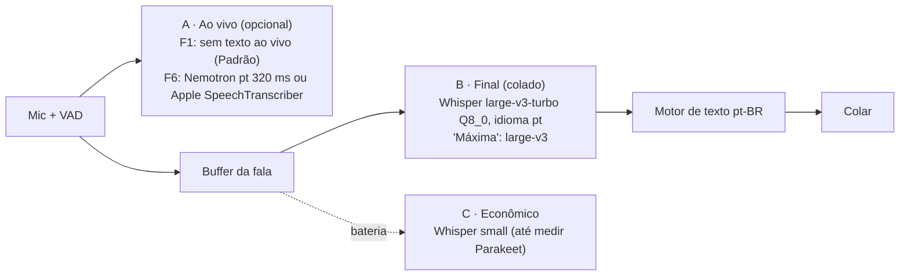
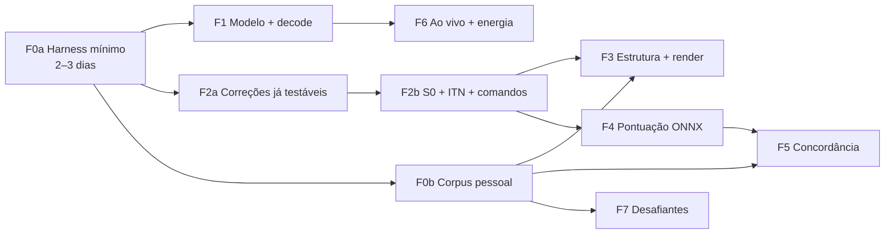

# ULTRAPLAN v2 — Motor de transcrição pt-BR do Handy Live PT

2026-09-26 · base `main@3925ee8` · alvo: MacBook Pro M3 Pro 18 GB, macOS 27.2, ditado pt-BR colado em qualquer app.
Evidências: `research-models.md` (RM), `research-formatting.md` (RF), `research-codebase.md` (RC), revisão independente `ULTRAPLAN-critique.md` (7 MUST-FIX e 18 SHOULD, todos incorporados abaixo).
`[MEDIDO]` = medido nesta máquina · `[INF]` = inferência · números externos têm fonte em RM/RF.

---

## 0. Diagnóstico

| #   | Problema                                                                                       | Causa                                                                                                                                           | Evidência                                    |
| --- | ---------------------------------------------------------------------------------------------- | ----------------------------------------------------------------------------------------------------------------------------------------------- | -------------------------------------------- |
| D1  | Seu setup atual: **Whisper Small**, idioma **auto**, VAD **Earshot** (experimental)            | configuração persistida; `auto` faz detecção de idioma a cada fala                                                                              | store local (RC §2.5); `settings.rs:691`     |
| D2  | Nemotron: pontuação corrida, "Stf", 1ª palavra em 3–4 s                                        | pior modelo moderno em pt-BR real (PT-BR LB 19.67 vs 13.1–13.3 Whisper); rodou em `auto`; ~2 s da latência vêm do pipeline, não do modelo [INF] | issue #4; RM §2, §5                          |
| D3  | Nenhum decode knob usado                                                                       | só `language`/`initial_prompt`; `pnc`, `itn`, `temperature`, `no_speech_thold`, `n_threads` ficam no default                                    | `transcription.rs:1774`                      |
| D4  | Prompt do Whisper = lista de palavras com vírgula                                              | o Whisper imita o _estilo_ do prompt; uma lista não ensina pontuação                                                                            | `transcription.rs:336`                       |
| D5  | Vocabulário custom não funciona em pt                                                          | fuzzy só ASCII + Soundex inglês → "Itaú", "João" ignorados; sem regras "Stf→STF"; e é **pulado** para Whisper quando há prompt                  | `text.rs:34,58,113`; `transcription.rs:2223` |
| D6  | Sem ITN, comandos de voz, parágrafos, listas, caixa pt                                         | não existe estágio determinístico                                                                                                               | `transcription.rs:2215`                      |
| D7  | Sem muletas pt ("é…", "hã", "ahn")                                                             | listas só en/de/fr                                                                                                                              | `text.rs:305`                                |
| D8  | Pausas perdidas                                                                                | VAD corta silêncio antes do ASR                                                                                                                 | `recorder.rs:741-753`                        |
| D9  | Polish por LLM: atalho separado, prompt em inglês, sem timeout, cola texto cru se o JSON falha | `actions.rs:162-386, 326-334`; `llm_client.rs:176`                                                                                              |
| D10 | Overlay mostra texto cru; final difere                                                         | pós-processo só no final                                                                                                                        | `transcription.rs:1617`                      |
| D11 | Não dá para medir                                                                              | CLI `-f` sem WER/F1/manifesto/idioma e **sem VAD** (o app transcreve só o que o VAD manteve)                                                    | `lib.rs:529-576`                             |

**Conclusão**: a maior parte do ganho não exige modelo novo. Vem de:

1. escolher o modelo certo e fixar `pt`;
2. um motor determinístico pt-BR de texto;
3. medir.

Modelos extras (pontuação ONNX, LLM) entram só onde a medição mostrar lacuna.

---

## 1. Seleção de modelos

### 1.1 Ranking pt (WER normalizado, pontuação removida — compare só dentro da coluna)

| Modelo (roda hoje no Handy)              | FLEURS-pt |   MLS-pt | PT-BR LB médio / CORAA | Fala de 20 s no M3 Pro          | Pontuação nativa               |
| ---------------------------------------- | --------: | -------: | ---------------------: | ------------------------------- | ------------------------------ |
| Whisper large-v3                         |  **3.50** |     6.37 |       **13.12** / 23.8 | ~1.9–2.9 s [INF]                | Sim (validada por você)        |
| **Whisper large-v3-turbo**               |      3.77 | **5.48** |           13.32 / 23.9 | **~0.75–1.1 s** [INF]           | Sim (pt não medida)            |
| Voxtral Mini 3B                          |      3.52 |     6.63 |                      — | ~2.7–4.1 s [INF]                | Sim                            |
| Qwen3-ASR 1.7B                           |      3.97 |     8.64 |                      — | ~1.0–1.6 s [INF]                | Sim                            |
| Parakeet TDT v3                          |      4.46 |     7.70 |           13.91 / 22.8 | ~0.2–0.3 s [INF]                | Sim (treinado em **pt-PT**)    |
| Parakeet v3 **pt-BR FT** (alexandreacff) |      3.66 |    10.96 |        **9.46 / 12.5** | ~0.2–0.3 s [INF]                | **Desconhecida**; precisa GGUF |
| Nemotron 3.5 streaming                   |      5.80 |    10.70 |           19.67 / 32.3 | 48× no caminho offline [MEDIDO] | Fraca [MEDIDO]                 |
| Whisper small (atual)                    |    7.65\* |        — |           21.16 / 34.6 | 46–48× [MEDIDO]                 | Boa [MEDIDO]                   |

\* FLEURS do próprio transcribe.cpp (outro normalizador).

Nota de custo: o Whisper paga uma janela de 30 s inteira no encoder. O turbo mantém o encoder de 32 camadas do large-v3 e só encolhe o decoder. Por isso, **reprocessar trechos curtos com Whisper custa quase uma janela cheia**: ~0.6–0.9 s por trecho com turbo no M3 Pro [INF].

### 1.2 Camadas

| Camada                    | Padrão                                                                                               | Por quê                                                                                                                                               | Regra de troca                                                                                                              |
| ------------------------- | ---------------------------------------------------------------------------------------------------- | ----------------------------------------------------------------------------------------------------------------------------------------------------- | --------------------------------------------------------------------------------------------------------------------------- |
| **B · Final**             | **large-v3-turbo Q8_0 (886 MB)**, `language=pt`                                                      | precisão ≈ large-v3 em pt (±0.3 pp) a 2.6× a velocidade                                                                                               | volta ao large-v3 se o F1 de pontuação pt do turbo ficar > 2 pp abaixo, com IC 95%                                          |
| B · Máxima (opt-in)       | large-v3 Q8_0                                                                                        | melhor FLEURS-pt; sua referência                                                                                                                      | —                                                                                                                           |
| B · Desafiante            | Parakeet v3 pt-BR FT → GGUF                                                                          | melhor pt-BR espontâneo publicado (CORAA 12.5 vs 23.8), ~4× mais rápido que o turbo                                                                   | promove só se vencer o turbo no seu corpus **e** pontuar ≥ turbo − 2 pp; treino não documentado (possível overfit em CORAA) |
| **A · Ao vivo, até a F6** | **Modo Padrão (sem texto ao vivo)**                                                                  | o Preview com Whisper reprocessa o trecho em curso e o resto no stop, antes do passe final (`transcription.rs:1386-1420`), estourando a meta de colar | Preview continua opcional; F1 corrige o stop para descartar o trecho em curso                                               |
| A · Ao vivo, F6           | Nemotron pt, preset Equilibrado (320 ms), em 2º slot de engine; **ou** Apple SpeechTranscriber (ANE) | streaming nativo; o texto ao vivo é descartado, então a pontuação fraca do Nemotron não importa                                                       | decidido na F6 por latência e disputa de GPU                                                                                |
| **C · Econômico**         | Whisper small (pontuação e ITN bons [MEDIDO])                                                        | Parakeet v3 é pt-PT ("facto", "equipa")                                                                                                               | Parakeet assume se o mapa pt-PT→pt-BR (S2b) + medição aprovarem                                                             |

Descartados para pt:

- Canary-Qwen, Kyutai, Moonshine, SenseVoice e distil-large-v3: sem pt.
- Voxtral Small 24B: não cabe no orçamento Metal de 13.6 GB.
- Fun-ASR-Nano: 28% de WER.

Em observação: Voxtral Realtime 4B (FLEURS-pt 5.03 @480 ms; ~2.5–3.7× de folga no M3 Pro [INF]).

---

## 2. Motor de texto pt-BR

### 2.1 Três costuras no código (não "uma linha")

| Costura           | Onde                                                                                      | Estágios               | O que tem à mão                                |
| ----------------- | ----------------------------------------------------------------------------------------- | ---------------------- | ---------------------------------------------- |
| **Núcleo** (puro) | `post_process_transcription_text` (`transcription.rs:2215`) → módulo novo `text_pt::core` | S1–S5, S7 sem AX       | texto, settings, trace de pausas (S0)          |
| **App**           | `process_transcription_output` (`actions.rs:463`) → `text_pt::app`                        | S6, S7-AX, S8, S9, S10 | AppHandle, bundle ID do app da frente, modelos |
| **Render/colar**  | `clipboard.rs:780` + `paste_tx/macos.rs` → `text_pt::render`                              | S11                    | classe do app, tipos da área de transferência  |

As três chamam uma função pura `format(trace, ctx)`. O harness de avaliação chama a mesma função com um `ctx` fixo (app simulado, pausas gravadas), então **todos os estágios são mensuráveis sem abrir o app**. Toda a lógica fica em módulos novos, com call sites de 1–3 linhas, para minimizar conflitos com o upstream.

### 2.2 Pipeline

```mermaid
flowchart LR
  ASR[ASR final\ntexto + tokens p + segmentos] --> S1
  VAD[(S0 pausas reais\ngap_ms por segmento)] --> S4
  VAD --> S10
  subgraph CORE ["Núcleo · puro · ≤ 10 ms"]
    S1[S1 tokens + offsets\n'literal'] --> S2[S2 vocabulário\ncaixa exata, fuzzy sem acento,\nfonética pt, regras X→Y,\nS2b pt-PT→pt-BR]
    S2 --> S3[S3 ITN pt-BR\nNumberStyle]
    S3 --> S4[S4 comandos de voz\ncom gate de pausa]
    S4 --> S5[S5 muletas pt + gaguejo\n+ eco de prompt]
    S5 --> S7a[S7 caixa pt\nmeses, siglas, início de frase]
  end
  S7a --> G6{S6 densidade\nde pontuação}
  subgraph APP ["App"]
    G6 -->|trecho fraco / ASR não-Whisper| PM[Classificador ONNX]
    G6 -->|ok| AX
    PM --> AX[S7-AX contexto do cursor]
    AX --> G8{S8 polish?\nopt-in + gate de confiança}
    G8 -->|sim| L[Concordância / homófonos\nprazo 600 ms]
    L --> S9[S9 guardas]
    G8 -->|não| S10
    S9 -->|aceita| S10[S10 parágrafos + listas]
    S9 -->|rejeita / timeout| S10
  end
  S10 --> S11[S11 render por app\ntexto / markdown / HTML+texto] --> PASTE[Colar]
```

### 2.3 Estágios e orçamento

| #   | Estágio                                                                                                                                                                                                                                                           | Resolve                          | Ao vivo?     | p95 no M3 Pro                                   |
| --- | ----------------------------------------------------------------------------------------------------------------------------------------------------------------------------------------------------------------------------------------------------------------- | -------------------------------- | ------------ | ----------------------------------------------- |
| S0  | Gravar início e fim de relógio de cada segmento de VAD, `gap_ms` e o fim da fala; mapear os segmentos do Whisper de volta                                                                                                                                         | D8; gate de comandos; parágrafos | —            | 0 pós-stop                                      |
| S1  | Tokenização com offsets; comando "literal"                                                                                                                                                                                                                        | base                             | sim          | < 1 ms                                          |
| S2  | Vocabulário: Unicode, sem acento, chave fonética pt (BuscaBR), léxico de caixa exata (STF, INSS, Petrobras + do usuário), regras X→Y na UI, glossário tech/inglês (Kubernetes, deploy…). **Roda também para Whisper** (hoje é pulado quando há prompt)            | D5, "Stf", "cubernetes"          | sim          | < 2 ms                                          |
| S2b | Mapa pt-PT→pt-BR (facto→fato, equipa→equipe, registo→registro, ecrã→tela, autocarro→ônibus, -cção→-ção), só para Parakeet                                                                                                                                         | pt-PT                            | sim          | < 1 ms                                          |
| S3  | ITN pt-BR: `text2num` + gramática de spans (IDs → e-mail/URL → R$ → % → medidas → hora com gatilho → data → decimal → cardinal/ordinal), com mistura de dígitos e extenso; `NumberStyle` configurável (`18h30`/`18:30`, `R$ 15.000`/`R$ 15.000,00`, `10%`/`10 %`) | D6                               | sim          | < 5 ms / 500 palavras (0.89 ms / 1400 [MEDIDO]) |
| S4  | Comandos de voz (§2.5), com regras de **match mais longo, contexto numérico, veto por determinante e gate de pausa**                                                                                                                                              | D6                               | sim          | < 1 ms                                          |
| S5  | Muletas pt ("é", "hã", "ahn"; **nunca** "um"; "né"/"tipo" só no modo agressivo); gaguejo; remover eco exato do prompt                                                                                                                                             | D7; vazamento de prompt          | sim          | < 1 ms                                          |
| S6  | Classificador de pontuação+caixa ONNX (romance 144 MB vs MiniLM 34 MB), **só** em trechos longos sem ponto ou para ASR não-Whisper                                                                                                                                | D2                               | não          | ≤ 80 ms [a medir]                               |
| S7  | Caixa pt (Base XIX: meses e dias minúsculos), siglas, início de frase; com AX: não capitalizar inserção no meio de frase (lê ≤ 200 caracteres antes do cursor, nunca em campo seguro, nunca registra)                                                             | D2                               | sim (sem AX) | < 2 ms; AX ≤ 10 ms à parte                      |
| S8  | Polish opt-in: concordância, crase, homófonos listados (mas/mais, há/a, sessão/seção/cessão, concerto/conserto, porquês) — §2.6                                                                                                                                   | concordância                     | não          | prazo duro 600 ms                               |
| S9  | Guardas: palavras preservadas (normalizado); só flexão do mesmo lema (fonte: pacote pt do LingoTweaker ou afixos Hunspell pt_BR), crase ou par de homófonos listado; ≤ max(2, 5%) palavras editadas; spans protegidos intactos. Se falhar, fica a saída anterior  | risco de LLM                     | —            | < 2 ms                                          |
| S10 | Parágrafo: comando > (pausa ≥ 1.5 s **e** bloco ≥ 40 palavras) > bloco ~90 palavras no fim de frase com maior pausa. Lista: explícita > ≥ 2 ordinais sequenciais em início de oração                                                                              | parágrafos, listas               | só comandos  | < 1 ms                                          |
| S11 | Render por classe de app (bundle ID): **texto** (terminal/IDE: `1. `, `- `); **markdown** (Obsidian, Slack, GitHub); **rico** (Notes, Pages, Mail, Word, Docs: `public.html` `<ol>/<ul>` + texto). Chat: 1 parágrafo e ponto final opcional                       | listas                           | —            | < 5 ms                                          |

Orçamentos p95:

| Parte              | Orçamento                                      |
| ------------------ | ---------------------------------------------- |
| Núcleo (S1–S5, S7) | ≤ 10 ms                                        |
| AX                 | ≤ 10 ms                                        |
| Render             | ≤ 5 ms                                         |
| S6                 | ≤ 80 ms                                        |
| S8                 | ≤ 600 ms                                       |
| **Total pós-ASR**  | **≤ ~110 ms sem polish; ≤ ~710 ms com polish** |

Princípios:

- O texto colado é sempre recalculado do texto final.
- O overlay roda o núcleo, então a formatação do ao vivo bate com a do colado. No modo Preview, as palavras ainda podem diferir, porque é outra decodificação.
- Tudo é fail-open.
- Comandos congelam marcas: o classificador só preenche lacunas.
- A estrutura (parágrafos e listas) fica fora da banda, então o LLM não consegue derrubá-la.

### 2.4 Armadilhas pt-BR que viram testes (amostra das 22 de RF §2.3)

| Armadilha                      | Regra                                                                                           |
| ------------------------------ | ----------------------------------------------------------------------------------------------- |
| "um" artigo vs número          | vira `1` só com medida, moeda ou contexto numérico                                              |
| "vírgula" decimal vs pontuação | entre dois números = decimal (`3,5`)                                                            |
| "ponto"                        | vira `.` só no fim da fala ou antes de pausa; veto após determinante ("esse ponto", "em ponto") |
| "dois pontos"                  | vira `:` só antes de pausa ou de lista/aspas; nunca após verbo/número ("ganhou dois pontos")    |
| "meio"                         | vira `1/2` só após número ("dois e meio" → 2,5)                                                 |
| Horas                          | "18 e 30" só com gatilho ("às", "horas")                                                        |
| Datas                          | "primeiro de janeiro" → `1º de janeiro`                                                         |
| Moeda                          | `R$ 15.000,00`                                                                                  |
| Meses                          | minúsculos no meio da frase                                                                     |
| Marca duplicada                | o ASR já emitiu `,` e você disse "vírgula" → uma só                                             |

Goldens: fixtures de ITN pt do NeMo (Apache-2.0) portadas, com lista documentada de desvios para a convenção brasileira.

### 2.5 Comandos de voz pt-BR

| Falado                            | Saída                   | Falado                      | Saída             |
| --------------------------------- | ----------------------- | --------------------------- | ----------------- |
| vírgula                           | `,`                     | nova linha                  | `\n`              |
| ponto / ponto final               | `.` (com gate)          | novo parágrafo              | `\n\n`            |
| ponto de interrogação             | `?`                     | abre / fecha aspas          | `“` `”`           |
| ponto de exclamação               | `!`                     | abre / fecha parênteses     | `(` `)`           |
| dois pontos                       | `:` (com gate)          | travessão / hífen           | `—` / `-`         |
| ponto e vírgula                   | `;`                     | reticências                 | `…`               |
| arroba / barra / cerquilha        | `@` `/` `#`             | tudo em maiúsculas … fim    | CAIXA ALTA        |
| sem espaço                        | junta palavras          | literal \<palavra\>         | a própria palavra |
| lista numerada / lista de tópicos | inicia lista            | próximo item / fim da lista | item / fecha      |
| apaga isso (opt-in)               | remove a frase anterior |                             |                   |

Pela única avaliação pt publicada (Whisper large v2, 2023), o Whisper nunca emite `:` e `;`. A F0a re-verifica isso no turbo e no v3.

### 2.6 Concordância e polish: três candidatos, decididos por medição

| Opção                                                      | Como                                                                                                              | Latência estimada (100 palavras)                                                                          | Risco                                                              | Privacidade                                          |
| ---------------------------------------------------------- | ----------------------------------------------------------------------------------------------------------------- | --------------------------------------------------------------------------------------------------------- | ------------------------------------------------------------------ | ---------------------------------------------------- |
| **LanguageTool / LingoTweaker**, só categoria concordância | regras (~3000 pt, incluindo concordância nominal e verbal); aceita só sugestão única; saída já é lista de edições | LT: 89–442 ms (dado de alemão; pt a medir; RAM da JVM a medir). LingoTweaker: Rust, alpha                 | falso positivo em nomes → suprimir em spans protegidos             | local                                                |
| **Qwen3-1.7B Q4 via `llama-server` (sidecar)**             | **reescrita + prompt lookup (n = 2–3)**, depois guardas S9 por diff                                               | 0.43–0.78 s com texto já pontuado [INF]. Lista de edições custaria 0.92–1.00 s, por isso não é usada aqui | over-edit (o GPT-3.5 alterou 30.7% das frases pt-BR corretas) → S9 | local; sidecar evita duas cópias de ggml no processo |
| **Apple Foundation Models** (ponte já existe)              | lista de edições `@Generable`, com sessão pré-aquecida no início da gravação                                      | reescrita ~2.2 s (M4 Max); lista curta a medir                                                            | sem score pt publicado                                             | local, 0 download                                    |

Regras comuns a todas as opções:

- prompt em pt-BR, por idioma;
- gate de confiança: pula quando todos os tokens têm `p ≥ τ` e o LT não acha nada;
- prazo de 600 ms e fail-open;
- nunca colar texto cru do LLM (corrigir `actions.rs:326-334`);
- sem retry que dobra a latência.

---

## 3. Fases (entrega valor na 1ª semana)

### F0a · Harness mínimo (2–3 dias)

- CLI `--manifest m.jsonl`, `--language`, **`--vad {off,silero,earshot}`** (repassa quadros pelo mesmo código de VAD do app). Saída JSON por fala: texto cru, final, trace por estágio via `format(trace, ctx)`, tempos.
- Métricas:
  - WER/CER normalizado e WER formatado;
  - P/R/F1 por `, . ? ! :`;
  - ITN exact-match;
  - preservação: WER entre palavras do ASR e do final, ignorando pontuação e caixa.
- **Trace de latência** no app: tecla abaixada → 1º quadro → 1ª fala no VAD → 1º feed → 1ª emissão; soltar → colar. Diagnostica os 3–4 s do issue #4.
- Dados: FLEURS pt_br (200 falas) + 20–30 falas suas + 20 sondas de silêncio (no caminho com VAD).
- Linha de base: **sua config real** (small + auto + Earshot) × turbo + pt × Silero vs Earshot.

### F1 · Modelo e decode (sai na 1ª semana)

- Recomendar e ativar turbo Q8_0 + `pt`. Migração de uma vez ("Você dita em português?"), porque o `auto` já está gravado e o default serde não o altera.
- Prompt do Whisper: 2–3 frases pt bem pontuadas + glossário, com probe de eco (S5 remove eco exato).
- Knobs: `temperature_fallback`, `no_speech_thold`, `n_threads` nos P-cores; `pnc`/`itn` do modelo quando suportado.
- Stop do Preview: descartar o trecho em curso e o resto, indo direto ao passe final.
- Nemotron: medir `pt` forçado × auto e presets 0/3/6/13.
- Quantização pt: Q8_0 vs Q5_K_M vs Q4_K_M.
- Métrica e recomendação pt-BR num **arquivo overlay** separado do `catalog.json`, que o upstream regenera inteiro.

### F2a · Correções já testáveis (1ª semana, sem corpus)

- Léxico de siglas e caixa exata ("Stf" → "STF").
- Muletas pt.
- Vocabulário Unicode sem acento + fonética pt; regras X→Y na UI; S2 rodando também para Whisper.
- Meses e dias minúsculos.
- Núcleo aplicado ao overlay.
- Testes unitários e property test de preservação.

### F2b · S0 + ITN + comandos

- S0 no recorder (relógio real por segmento).
- ITN com `NumberStyle` e goldens (NeMo portado + 22 armadilhas).
- Comandos §2.5 com as regras de RF §6 como testes de aceite: match mais longo, contexto numérico, veto por determinante, gate de pausa, dedupe.
- "apaga isso" opt-in.

### F0b · Corpus pessoal (em paralelo; depende de você)

- 80–120 falas (~45–60 min) com texto-alvo escrito à mão.
- **Cotas**: ≥ 30 perguntas, ≥ 15 listas, ≥ 15 multi-parágrafo, ≥ 20 com muitos números, ≥ 15 com termos em inglês, ≥ 15 com homófonos; microfone embutido + headset; silêncio e ruído.
- **Conjunto de concordância**: ≥ 200 frases corretas (dos alvos) + ≥ 200 com erros injetados e rotulados (concordância nominal/verbal, crase, homófono).
- CORAA v1.1 (500 estratificadas) como controle.
- **Privacidade**: tudo na pasta de dados do app (fora do git); opt-in separado para áudio e texto; retenção e apagar; cifrado; o histórico passa a guardar texto cru e id do modelo só com opt-in.

### F3 · Estrutura e render

- Parágrafos e listas (S10) com limiares ajustados no F0b.
- Paste rico: declarar `public.html` + texto; `provideDataForType` para HTML; **contar leitura HTML como recibo** para a restauração da área de transferência (`paste_tx/macos.rs:58-65, 283`).
- Tabela bundle ID → classe; matriz de apps: Notes, Pages, Mail, Word, Docs (Chrome/Safari), Slack, WhatsApp, Obsidian, VS Code, Terminal.

### F4 · Pontuação ONNX (S6)

- A/B romance vs MiniLM via `ort`, só em trechos fracos.
- Pré-carregado no início da gravação.

### F5 · Concordância (S8/S9)

- Guardas S9 primeiro, com a fonte de lemas definida.
- Três candidatos da §2.6 medidos no conjunto de concordância.
- Polish vira opção do fluxo normal, não só do 2º atalho.
- Endurecer o LLM: timeout, prompts por idioma, Apple FM pré-aquecido, sem retry, chaves no Keychain.

### F6 · Ao vivo e energia

- 2º slot de engine: Nemotron ao vivo + turbo final. Ao soltar a tecla, **cancela o stream** (texto descartado) e roda o final. Não existe prioridade de GPU no ggml; o que dá para fazer é medir a disputa enquanto se fala.
- Spike Apple SpeechTranscriber (ANE).
- Harness de replay a 1× para medir o 1º parcial.
- Camada C: troca ao desconectar da tomada, com pré-carga em background e dispositivo por modelo (hoje o acelerador é global).

### F7 · Desafiantes

- Parakeet pt-BR FT → GGUF (precedente: parakeet-primeline); medir pontuação.
- Soak de 10 min do Voxtral Realtime.
- Qwen3-ASR 1.7B e Voxtral Mini 3B como desafiantes de B.

---

## 4. Metas

Regra: toda meta é **Δ vs a linha de base da F0a, com IC 95% por bootstrap pareado, por faixa de duração** (≤ 10 s, 10–30 s, > 30 s). Números absolutos são provisórios até a F0a.

| Área                         | Meta                                                                                        | Fase  |
| ---------------------------- | ------------------------------------------------------------------------------------------- | ----- |
| Precisão                     | WER normalizado P0: melhora significativa vs small+auto; provisório ≤ 0.7×                  | F1    |
| Latência final (sem polish)  | soltar→colar p95: ≤ 10 s de fala → ≤ 1.0 s; 10–30 s → ≤ 1.8 s (provisório); > 30 s medido   | F1    |
| Latência com polish          | + ≤ 600 ms sobre a linha acima                                                              | F5    |
| Latência ao vivo             | 1º parcial p95 ≤ 700 ms, depois de corrigir o overhead de pipeline medido na F0a            | F6    |
| Pontuação                    | F1 de `.` `,` `?`: ≥ large-v3 − 2 pp (sem absoluto até medir)                               | F1/F4 |
| Siglas e caixa               | 100% do léxico correto ("STF", nunca "Stf")                                                 | F2a   |
| ITN                          | ≥ 95% exact-match nos goldens; 0 regressões nas 22 armadilhas                               | F2b   |
| Comandos                     | 0 disparos nos casos de veto ("ganhou dois pontos", "em ponto"); ≥ 98% nos comandos da §2.5 | F2b   |
| Listas                       | precisão ≥ 0.95 com n ≥ 15 ditados de lista (IC reportado)                                  | F3    |
| Parágrafos                   | F1 de quebra > heurística de comprimento na linha de base                                   | F3    |
| Concordância                 | TNR ≥ 95% em frases corretas; F0.5 > 0 com IC acima da linha "sem polish"                   | F5    |
| Preservação                  | 0 palavras alteradas fora das transformações declaradas                                     | F2a+  |
| Alucinação (caminho com VAD) | 0 palavras inseridas nas sondas de silêncio                                                 | F1    |
| Energia                      | J por minuto de áudio e W médio reportados; camada C ≤ 5 W de pacote                        | F6    |
| Custo                        | núcleo ≤ 10 ms p95; RAM de modelos ≤ 4 GB                                                   | todas |

---

## 5. Riscos

| Risco                                                                                                  | Mitigação                                                                                                                |
| ------------------------------------------------------------------------------------------------------ | ------------------------------------------------------------------------------------------------------------------------ |
| Conflito com upstream (`transcription.rs`, `settings.rs`, `actions.rs`, `bindings.ts`, `catalog.json`) | módulos novos `text_pt::{core,app,render}`; call sites de 1–3 linhas; settings numa struct; overlay de catálogo separado |
| LLM reescreve o que você disse                                                                         | S9 + gate de confiança + fail-open + opt-in                                                                              |
| Comandos e listas disparando sem querer                                                                | gate de pausa, veto por determinante, ≥ 2 pistas, "literal"; precisão como gate de release                               |
| Duas cópias de ggml no processo                                                                        | LLM como sidecar ou Apple FM                                                                                             |
| Eco do prompt do Whisper, sobretudo em trechos curtos                                                  | S5 remove eco exato; probe no harness                                                                                    |
| Latência por janela de 30 s do Whisper                                                                 | turbo padrão; nada de Whisper no ao vivo até a F6                                                                        |
| Parakeet escreve em pt-PT                                                                              | S2b + medição antes de virar camada C                                                                                    |
| Corpus pequeno                                                                                         | cotas por fenômeno, IC, FLEURS/CORAA de controle                                                                         |
| Privacidade (histórico, AX, corpus)                                                                    | local, opt-in, cifrado, fora do git; AX limitado e sem log                                                               |
| Earshot experimental afeta VAD, pausas e alucinação                                                    | Silero vs Earshot na linha de base; escolher antes de ajustar S10                                                        |

---

## 6. Decisões suas

**Respondidas em 27/09/2026:**

1. Corpus: sim. São ~60 min em blocos de 6–8 min, gravados aos poucos (`docs/corpus-f0b/`).
2. Polish: local por padrão, com a **nuvem como opção**.
3. Paste **rico (HTML)** nos apps que aceitam.
4. Ao vivo: **não** aceitar o modo Padrão até a F6. O objetivo é mostrar o máximo de texto ao vivo durante o ditado, então a F6 sobe de prioridade.
5. Muletas agressivas ("né", "tipo"): **remover por padrão**.
6. Números: **`18h30`** e **`R$ 15.000`**, sem centavos quando não ditos.

Perguntas originais:

1. **Corpus F0b**: gravar ~45–60 min de ditado real com texto-alvo. Sem ele, F3/F5 decidem só com FLEURS/CORAA.
2. **Polish**: só local, ou também nuvem como opção?
3. **Paste rico (HTML)** nos apps que aceitam, ou só texto com `1. ` / `- `?
4. **Ao vivo**: aceitar o modo Padrão (sem texto ao vivo) até a F6?
5. **Muletas agressivas** ("né", "tipo"): remover por padrão?
6. **Estilo numérico padrão**: `18h30` ou `18:30`; `R$ 15.000` ou `R$ 15.000,00`?
